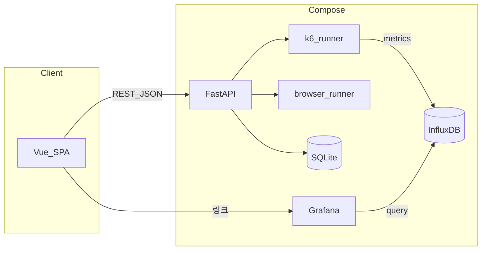

# 아키텍처 개요

웹 UI에서 성능 테스트를 정의·실행하고, HTTP(k6)·브라우저(Playwright)·DB 쿼리(k6 + xk6-sql)로 부하·측정을 수행합니다. 시계열 메트릭은 InfluxDB에 쌓이고 Grafana에서 시각화합니다. 상세 흐름은 [grafana-k6.md](./grafana-k6.md)를 참고하세요.

관련 문서: [database.md](./database.md) (스키마), [api.md](./api.md) (HTTP API). 초기 기능 스펙은 [specs/001-ui-perf-test-env/spec.md](../specs/001-ui-perf-test-env/spec.md)이며, 브라우저·다단계 시나리오 등은 구현이 스펙보다 확장되었습니다.

## 구성 요소

| 구분 | 기술 | 역할 |
|------|------|------|
| 프론트엔드 | Vue 3, Vite | 테스트 CRUD, 실행·결과 화면 |
| 프론트 배포 | nginx (Docker 이미지) | 정적 파일 서빙 |
| API | FastAPI (`backend/app`) | REST, 실행 오케스트레이션 |
| HTTP 부하 | k6 (`k6_runner`) | 시나리오/단일 요청 부하, Influx 출력 |
| 브라우저 | Playwright (`browser_runner`) | 페이지 로드·액션, Web Vitals |
| DB 쿼리 | k6 + xk6-sql (`k6_runner`, engine=`db`) | DSN에 SQL 반복 실행, 실행시간·TPS·실패율 측정 |
| 앱 DB | SQLite(기본) 또는 `DATABASE_URL` | 테스트 정의·실행·결과·요청별 로그 |
| 메트릭 | InfluxDB 1.x | k6 메트릭 |
| 대시보드 | Grafana | k6·브라우저 Web Vitals 대시보드 |

## Docker Compose

[`docker/compose.yaml`](../docker/compose.yaml) 기준:

| 서비스 | 포트 | 설명 |
|--------|------|------|
| `api` | 8080 | FastAPI |
| `ui` | 3000 | 프론트 (nginx) |
| `influxdb` | 8086 | DB `k6` |
| `grafana` | 3001 (호스트) → 컨테이너 3000 | 프로비저닝된 데이터소스·대시보드 |

볼륨: `api_data`(SQLite·k6 픽스처 등), `influxdb_data`, `grafana_data`.

API 컨테이너에 자주 쓰는 환경 변수 예:

- `DATABASE_URL` — 기본값 예: `sqlite:////app/data/app.db`
- `INFLUXDB_URL` — k6가 메트릭을 보낼 주소
- `GRAFANA_DASHBOARD_URL` — UI에 노출할 k6 대시보드 URL
- `GRAPHIO_K6_FIXTURE_DIR` — multipart 업로드 파일 저장 (Compose에서는 `/app/data/k6_fixtures` 권장)

## 요청·데이터 흐름

## 백엔드 구조

- 앱 진입: [`backend/app/main.py`](../backend/app/main.py) — 라우터 `tests`, `runs`, `config`, `uploads`, CORS, `/health`
- API: `backend/app/api/` (`tests.py`, `runs.py`, `config.py`, `uploads.py`, `schemas/`)
- 도메인 서비스: `backend/app/services/` — 예: `k6_runner`, `browser_runner`, `test_repository`, `run_repository`, `result_repository`, `run_request_repository`, `influxdb_writer`, `error_page_rules`
- 모델: [`backend/app/models/db.py`](../backend/app/models/db.py)

## 실행 엔진 (`http` / `browser` / `db`)

- 테스트 정의 `performance_test.engine` 값이 `http`(k6)·`browser`(Playwright)·`db`(k6 + xk6-sql)입니다. 실행 레코드 `test_run`에도 동일하게 기록됩니다.
- **`POST /tests/{testId}/runs`로 실행을 시작할 때 사용할 엔진은 항상 저장된 테스트 정의의 `engine`입니다.** 요청 본문의 `engine` 필드로 바꾸지 않습니다.
- 같은 요청 본문에서 의미 있는 필드는 `requestHeaderOverrides`(실행 시에만 합쳐지는 헤더), `showBrowser`(브라우저 모드일 때 창 표시 여부, 로컬/DISPLAY 필요)입니다. 구현은 [`backend/app/api/runs.py`](../backend/app/api/runs.py)를 참고하세요.

### `db` 엔진 (DB 쿼리 부하)

- `db` 엔진도 `http`처럼 `k6_runner`가 처리합니다. 차이는 생성하는 k6 스크립트뿐입니다([`k6_db_script.tpl`](../backend/app/services/templates/k6_db_script.tpl)): `k6/x/sql`로 연결을 열고 VU마다 `db_query`를 반복 실행합니다.
- 필드 매핑: **DSN(연결 문자열)은 `target_url`을 재사용**하고, 드라이버 ID는 `db_driver`, 실행할 SQL은 `db_query`에 저장합니다. `vus`/`duration`/`ramp_up`/`iterations`/`request_delay`는 HTTP와 동일하게 동작합니다.
- 메트릭은 커스텀 `query_duration`(Trend), `query_errors`(Rate)와 내장 `iterations`로 집계하며, `_parse_k6_db_summary`가 응답시간/실패율/TPS로 변환합니다. `__REQ__`·`__K6_SUMMARY_JSON__` 마커와 결과 저장 파이프라인은 HTTP와 공유합니다.
- **xk6-sql는 표준 k6 바이너리에 없으므로** `backend/Dockerfile`이 멀티스테이지(`xk6 build --with github.com/grafana/xk6-sql --with .../xk6-sql-driver-postgres`)로 커스텀 k6를 빌드합니다. 지원 드라이버는 `SUPPORTED_DB_DRIVERS`(현재 `postgres`)와 `k6_runner._DB_DRIVER_IMPORTS`, Dockerfile의 `--with`가 항상 일치해야 합니다. 드라이버를 추가하려면 세 곳을 같이 늘리세요.
- 로컬에서 직접 `k6`로 실행한다면 위 명령으로 빌드한 바이너리가 PATH에 있어야 합니다(기본 `grafana/k6` 바이너리로는 `db` 테스트가 실패).

## 환경 변수 (백엔드)

[`backend/app/config.py`](../backend/app/config.py)에서 읽습니다.

| 변수 | 용도 |
|------|------|
| `DATABASE_URL` | SQLAlchemy 연결 문자열 |
| `GRAFANA_DASHBOARD_URL` | k6용 Grafana 대시보드 URL (`GET /config`에 노출) |
| `GRAFANA_BROWSER_VITALS_URL` | 비우면 `GRAFANA_DASHBOARD_URL`의 호스트에 `/d/browser-web-vitals/browser-web-vitals` 경로를 붙여 유도 |
| `INFLUXDB_URL` | k6 Influx 출력 대상 |
| `GRAPHIO_K6_FIXTURE_DIR` | `POST /uploads/k6-fixture` 저장 경로 (API와 k6가 같은 파일을 읽을 수 있어야 함) |
| `GRAPHIO_BROWSER_HEADLESS` | 브라우저 기본 헤드리스 여부 (`0`/`false` 등이면 창 모드 시도) |

`.env`는 `backend/.env` 또는 저장소 루트 `.env`에서 로드됩니다.

## 관련 문서

- [PRD](./prd.md)
- [Grafana / k6](./grafana-k6.md)
