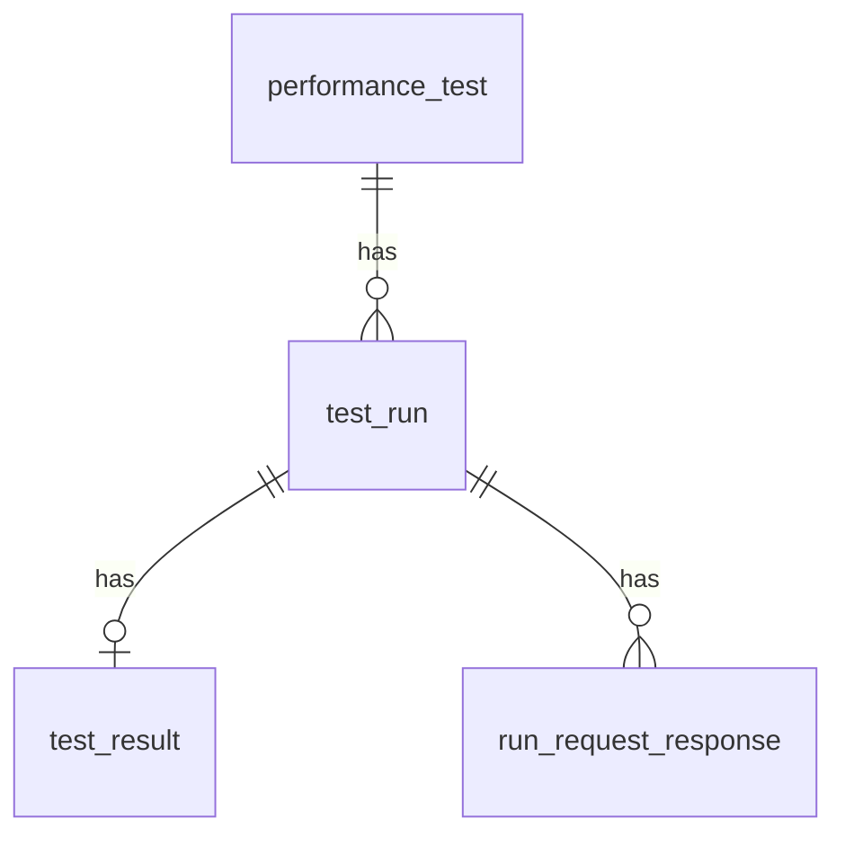

# 데이터베이스

앱 메타데이터·실행 요약·요청별 로그는 SQLAlchemy 모델로 정의됩니다. 스키마의 근거는 [`backend/app/models/db.py`](../backend/app/models/db.py)입니다.

관련: [architecture.md](./architecture.md), [api.md](./api.md).

## ER 다이어그램



## `performance_test`

테스트 정의 1건. `id`는 UUID 문자열(36자).

| 컬럼 | 타입(개념) | 설명 |
|------|------------|------|
| `id` | 문자열 PK | UUID |
| `name` | 문자열 | 테스트 이름 |
| `engine` | 문자열 | `http`(k6)·`browser`(Playwright)·`db`(k6+xk6-sql), 기본 `http` |
| `target_url` | 문자열 | http/browser: 기본 대상 URL. db: 연결 문자열(DSN). 다단계 시나리오면 1단계 URL과 동기화 |
| `query_params` | Text, JSON | `[{"key":"k","value":"v"}, ...]` 형태 문자열 |
| `http_method` | 문자열 | GET/POST 등 |
| `request_body` | Text | 단일 요청 모드 본문 |
| `headers` | Text, JSON | HTTP 헤더 객체 문자열 |
| `vus` | 정수 | 가상 사용자 수 |
| `duration` | 정수 | 지속 시간(초) |
| `request_delay` | 실수 | 요청 간 대기(초), 선택 |
| `ramp_up` | 정수 | 램프업(초), 0이면 없음 |
| `iterations` | 정수 | 총 반복(비우면 지속 시간 모드), nullable |
| `body_preview_size` | 정수 | UI에서 본문을 잘라 보여줄 글자 수(저장 길이와 무관), 기본 500 |
| `vu_url_suffix` | bool | URL 경로 끝에 `{{VU}}` 치환용 |
| `vu_start` | 정수 | `{{VU}}` 치환 시 첫 VU 값, 기본 1 |
| `error_page_rules` | Text, JSON | `[{"pattern":"...","matchMode":"contains"\|"not_contains"}, ...]` |
| `error_page_pattern` | Text | 첫 규칙과 동기화(레거시/API 호환) |
| `error_page_match_mode` | 문자열 | 기본 `contains` |
| `http_scenario` | Text, JSON | k6 다단계 시나리오 배열(비우면 단일 요청 모드) |
| `browser_actions` | Text, JSON | 브라우저 전용 Playwright 액션 배열 |
| `db_driver` | 문자열 | db 전용: xk6-sql 드라이버 ID(`postgres`), nullable |
| `db_query` | Text | db 전용: 반복 실행할 SQL, nullable |
| `created_at`, `updated_at` | DateTime | 생성·수정 시각 |

## `test_run`

실행 1건.

| 컬럼 | 설명 |
|------|------|
| `id` | UUID PK |
| `test_id` | `performance_test.id` FK, CASCADE 삭제 |
| `engine` | `http` / `browser` / `db` |
| `status` | `Ready` / `Running` / `Finished` / `Failed` |
| `started_at`, `finished_at` | 실행 구간 |
| `created_at` | 레코드 생성 시각 |

동시에 `Running`인 실행은 API에서 1건만 허용합니다.

## `test_result`

실행당 최대 1건(`run_id` unique).

| 컬럼 | 설명 |
|------|------|
| `id` | UUID PK |
| `run_id` | `test_run.id` FK |
| `avg_response_time`, `max_response_time` | ms 등 요약 |
| `failure_rate` | HTTP 관점 실패율(k6 등) |
| `overall_failure_rate` | 요청 행 기준 종합 실패율(비-2xx·규칙 실패 등) |
| `request_count`, `tps_or_rps`, `execution_time` | 요약 지표 |
| `error_message` | 실패 시 사유( stderr 등, 잘림) |
| `lcp_ms`, `fcp_ms`, `cls`, `ttfb_ms` | 브라우저 실행 시 Web Vitals, nullable |

## `run_request_response`

실행 중 각 “요청/스텝”별 기록. **run당 최대 1만 건**으로 제한됩니다(모델 주석).

| 컬럼 | 설명 |
|------|------|
| `id` | UUID PK |
| `run_id` | FK |
| `seq` | 순서(1-based). 브라우저 스크린샷 API는 `vu_index + 1`로 매핑 |
| `status_code` | HTTP 상태(브라우저 모드에서도 의미 있을 수 있음) |
| `response_time_ms` | 응답 시간 |
| `body_preview` | k6: 응답 본문 전체 문자열, browser: innerText 등 |
| `requested_at` | 요청 시각 |
| `request_args` | JSON 문자열: url, method, headers, body 등 |
| `screenshot` | 바이너리(이미지 blob). API는 JPEG로 반환 |
| `failed` | 에러 페이지 규칙 등으로 실패로 표시된 경우 true |

## JSON 필드 예시

### `query_params` (테스트 공통 쿼리)

```json
[{"key": "foo", "value": "bar"}]
```

### `error_page_rules`

```json
[
  {"pattern": "오류가 발생", "matchMode": "contains"},
  {"pattern": "OK", "matchMode": "not_contains"}
]
```

### `http_scenario` (k6 다단계)

배열 요소는 API camelCase와 동일한 형태로 저장됩니다. 최소 예:

```json
[
  {
    "method": "GET",
    "url": "https://api.example.com/health",
    "sleepAfterSeconds": 0.5
  },
  {
    "method": "POST",
    "url": "https://api.example.com/login",
    "headers": {"Content-Type": "application/json"},
    "body": "{\"user\":\"a\"}",
    "capture": {
      "from": "json",
      "path": "token",
      "var": "token"
    }
  }
]
```

`multipart`, `queryParams`, `capture`(json/header) 등 상세 제약은 [`backend/app/api/schemas/test.py`](../backend/app/api/schemas/test.py)의 `HttpScenarioStep`을 참고하세요.

### `browser_actions`

각 요소의 `type`은 `wait_selector`, `click`, `sleep`입니다.

```json
[
  {"type": "wait_selector", "selector": "#app", "timeoutMs": 30000},
  {"type": "sleep", "sleepMs": 1000},
  {"type": "click", "selector": "button.submit", "timeoutMs": 30000}
]
```

## 마이그레이션 (Alembic)

- 설정: [`backend/alembic.ini`](../backend/alembic.ini), 환경: [`backend/alembic/env.py`](../backend/alembic/env.py)
- 버전 스크립트: [`backend/alembic/versions/`](../backend/alembic/versions/)

신규 환경에서는 `DATABASE_URL`을 맞춘 뒤 `backend` 디렉터리에서 `alembic upgrade head`를 실행하는 것을 권장합니다.

Docker Compose 기본값에서는 SQLite 파일이 API 볼륨 아래(예: `/app/data/app.db`)에 둘 수 있습니다. 로컬 단독 실행 시 기본은 `backend/app.db`에 가깝게 동작할 수 있으므로 [`backend/app/config.py`](../backend/app/config.py)의 `DATABASE_URL`을 확인하세요.
